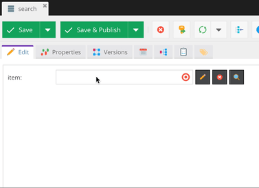

# Href typeahead field type


Adds typeahead functionality to href fields using a modified default search functionality

I temporary made documents and assets read only field in field configurator to prevent users to
select assets as a valid link at static/js/pimcore/object/classes/data/hrefTypeahead.js, but i didn't want 
to remove it because maybe we will add functionality to support assets and document
Also i added validation to prevent users to select more then one class
### Install
```bash
composer require youwe/pimcore-href-typeahead
```
### Files 
<dl>
  <dt><strong>static/js/pimcore/object/classes/data/hrefTypeahead.js</strong></dt>
  <dd>An exact copy of default href</dd>
  
  <dt><strong>static/js/pimcore/object/tags/hrefTypeahead.js</strong></dt>
  <dd>An exact copy of default href, with the change that textbox is now a combo with autocomplete provided by SearchController::findAction</dd>
    
  <dt><strong>models/Pimcore/Model/Object/ClassDefinition/Data/HrefTypeahead.php</strong></dt>
  <dd>An exact copy of default href</dd>
  
  <dt><strong>HrefTypeahead/controllers/SearchController.php</strong></dt>
  <dd>A controller containing autocomplete source</dd>
</dl>

### Events

When you want to add some extra filters to the search done by the href typeahead, you can use a listener.
An example:

Listener config (ie. in src/AppBundle/Resources/config/services.yml):

    AppBundle\EventListener\HreftypeaheadSearchListener:
        tags:
            - { name: kernel.event_listener, event: hreftypeahead.search, method: onSearch }

Listener code (ie. in AppBundle\EventListener\HreftypeaheadSearchListener):

    class HreftypeaheadSearchListener
    {
    
        /* @var HreftypeaheadSearchEvent */
        protected $e;
    
        public function __construct()
        {
        }
    
        public function onSearch(HreftypeaheadSearchEvent $e)
        {
            $this->e = $e;
            \Pimcore\Log\Simple::log('hreftypeahead', 'onSearch called!');
            \Pimcore\Log\Simple::log('hreftypeahead', 'source object class ' . get_class($e->getSourceObject()));
            \Pimcore\Log\Simple::log('hreftypeahead', 'condition count ' . count($e->getConditions()));
    
            if($c = $this->getAllowedObjectCondition()) {
                $e->addCondition($c);
            }
    
        }
        
        ......


### Limitations
* It only supports one object linked in href
